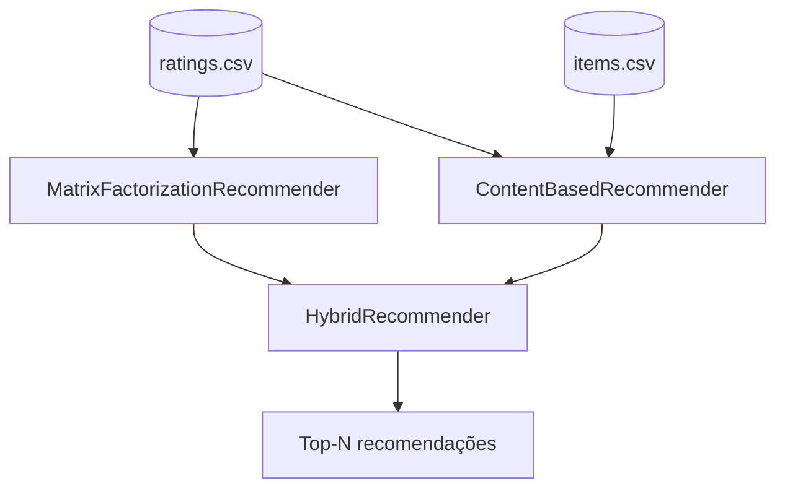

<div align="center">

# 🎯 Sistema de Recomendação de Machine Learning
### Filtragem Colaborativa · Baseada em Conteúdo · Híbrida — implementadas do zero

[](https://www.python.org/)
[](https://numpy.org/)
[](https://pandas.pydata.org/)
[](https://scikit-learn.org/)
[](https://jupyter.org/)
[](https://pytest.org/)
[](#-licença)

**Sistema de recomendação completo em Python, implementando três abordagens clássicas — filtragem colaborativa, baseada em conteúdo e híbrida — com pipeline de treino, avaliação e métricas de ranking, construído do zero apenas com NumPy, pandas e scikit-learn.**

[Visão Geral](#-visão-geral) •
[Arquitetura](#-arquitetura) •
[Instalação](#%EF%B8%8F-instalação) •
[Como Usar](#-como-usar) •
[Algoritmos](#-algoritmos-implementados) •
[Métricas](#-métricas-de-avaliação) •
[Resultados](#-resultados-de-exemplo)

</div>

---

## 🌐 Demonstração

🔗 **[benjaminreiis.github.io/recommender-system-ml](https://benjaminreiis.github.io/recommender-system-ml/)**

---

## 🔍 Visão Geral

O projeto resolve o problema clássico de recomendação **top-N**: dado o histórico de avaliações de usuários sobre itens (como em um catálogo de filmes, produtos ou músicas), prever quais itens ainda não vistos um usuário provavelmente vai gostar.

Três estratégias são implementadas e podem ser comparadas diretamente:

| Abordagem | Ideia central | Pontos fortes | Limitações |
|---|---|---|---|
| **Colaborativa** (Matrix Factorization) | Aprende fatores latentes de usuários e itens a partir das avaliações | Captura padrões complexos de gosto | Sofre com *cold start* (usuários/itens novos) |
| **Baseada em conteúdo** (TF-IDF + similaridade) | Recomenda itens com metadados parecidos aos que o usuário já gostou | Funciona bem para itens novos | Tende a recomendar itens muito parecidos (baixa serendipidade) |
| **Híbrida** | Combina as duas pontuações por média ponderada (`alpha`) | Mitiga as limitações de cada abordagem isolada | Requer ajuste do peso `alpha` |

---

## 🏗 Arquitetura

```text
                         ┌──────────────────────┐
                         │     ratings.csv       │
                         │  (user, item, nota)   │
                         └──────────┬───────────┘
                                    │
                 ┌──────────────────┼──────────────────┐
                 ▼                                      ▼
   ┌────────────────────────────┐         ┌────────────────────────────┐
   │  MatrixFactorizationRec.   │         │   ContentBasedRecommender   │
   │  (filtragem colaborativa)  │         │   (TF-IDF + cosseno)        │
   │                             │         │                             │
   │  rating_hat = μ + bu + bi   │         │  similaridade(item_i,item_j)│
   │              + pu · qi      │         │   a partir de categoria/tags│
   └─────────────┬───────────────┘         └─────────────┬───────────────┘
                 │                                        │
                 └───────────────────┬────────────────────┘
                                      ▼
                         ┌──────────────────────────┐
                         │     HybridRecommender      │
                         │  score = α·CF + (1-α)·CB   │
                         └────────────┬───────────────┘
                                      ▼
                         ┌──────────────────────────┐
                         │    Top-N recomendações     │
                         └──────────────────────────┘
```



---

## 📁 Estrutura do Projeto

```text
recsys/
│
├── data/
│   ├── ratings.csv              # Avaliações (user_id, item_id, rating, timestamp)
│   └── items.csv                # Metadados dos itens (categoria, tags, ano)
│
├── src/
│   ├── data_generator.py        # Geração de dataset sintético estilo MovieLens
│   ├── collaborative_filtering.py  # Matrix Factorization (SGD)
│   ├── content_based.py          # TF-IDF + similaridade de cosseno
│   ├── hybrid.py                  # Combinação ponderada CF + CB
│   ├── metrics.py                 # Precision@K, Recall@K, NDCG@K, Coverage
│   └── main.py                    # Pipeline end-to-end (treino + avaliação)
│
├── notebooks/
│   └── exploracao.ipynb           # Notebook interativo de demonstração
│
├── models/
│   └── training_curve.png         # Gráfico de convergência do treino
│
├── tests/
│   └── test_recommenders.py       # Testes unitários (pytest)
│
├── requirements.txt
└── README.md
```

---

## ⚙️ Instalação

> Requer **Python 3.9+**.

```bash
# Clone ou copie o projeto, depois entre na pasta
cd recsys

# (Recomendado) crie um ambiente virtual
python3 -m venv venv
source venv/bin/activate    # Windows: venv\Scripts\activate

# Instale as dependências
pip install -r requirements.txt
```

---

## 🚀 Como Usar

### Pipeline completo (treino + avaliação)

```bash
python src/main.py
```

Isso vai:

1. Gerar (ou carregar, se já existir) os dados sintéticos em `data/`
2. Treinar o modelo colaborativo e reportar `RMSE`, `MAE`, `Precision@10`, `Recall@10`, `NDCG@10`
3. Treinar o modelo baseado em conteúdo e mostrar itens similares de exemplo
4. Combinar os dois em um modelo híbrido e gerar recomendações de exemplo

### Uso programático

```python
import sys
sys.path.insert(0, "src")

import pandas as pd
from collaborative_filtering import MatrixFactorizationRecommender
from content_based import ContentBasedRecommender
from hybrid import HybridRecommender

ratings = pd.read_csv("data/ratings.csv")
items = pd.read_csv("data/items.csv")

# Modelo colaborativo
cf_model = MatrixFactorizationRecommender(n_factors=15, n_epochs=40, lr=0.005, reg=0.1)
cf_model.fit(ratings)

# Top-10 recomendações para o usuário 42
seen_items = ratings.loc[ratings["user_id"] == 42, "item_id"]
print(cf_model.recommend(user_id=42, n=10, exclude_seen=seen_items))

# Modelo baseado em conteúdo
cb_model = ContentBasedRecommender()
cb_model.fit(items)
print(cb_model.similar_items(item_id=10, n=5))

# Modelo híbrido
hybrid = HybridRecommender(cf_model, cb_model, alpha=0.7)
user_history = ratings[ratings["user_id"] == 42]
print(hybrid.recommend(user_id=42, user_ratings=user_history, n=10))
```

### Notebook interativo

```bash
jupyter notebook notebooks/exploracao.ipynb
```

---

## 🧠 Algoritmos Implementados

### 1️⃣ Filtragem Colaborativa — Matrix Factorization (Funk SVD)

Cada usuário `u` e item `i` são representados por vetores latentes `p_u` e `q_i`. A nota prevista é:

```
rating_hat(u, i) = μ + b_u + b_i + p_u · q_i
```

Onde `μ` é a média global, `b_u`/`b_i` são os "viéses" (bias) de usuário e item, e `p_u · q_i` é o produto interno dos fatores latentes. O treino usa **gradiente descendente estocástico (SGD)**, atualizando os parâmetros avaliação por avaliação, com regularização L2 para evitar overfitting — a mesma ideia popularizada durante o **Netflix Prize**.

### 2️⃣ Filtragem Baseada em Conteúdo — TF-IDF + Similaridade de Cosseno

Cada item é descrito por seus metadados textuais (categoria + tags). O texto é vetorizado com **TF-IDF** (Term Frequency–Inverse Document Frequency) e a similaridade entre itens é calculada por **similaridade de cosseno**. As recomendações para um usuário são geradas a partir da similaridade média com os itens que ele avaliou bem.

### 3️⃣ Modelo Híbrido

Combina as pontuações normalizadas (0–1) dos dois modelos por média ponderada:

```
score_hibrido = α · score_colaborativo + (1 - α) · score_conteúdo
```

O parâmetro `alpha` controla o equilíbrio entre os dois mundos e pode ser ajustado conforme o caso de uso (por exemplo, `alpha` mais baixo ajuda usuários ou itens novos, com pouco histórico).

---

## 📊 Métricas de Avaliação

O projeto avalia tanto a qualidade da previsão de nota quanto a qualidade do ranking de recomendações:

| Métrica | O que mede |
|---|---|
| **RMSE / MAE** | Erro entre a nota prevista e a nota real (quanto menor, melhor) |
| **Precision@K** | Entre os top-K recomendados, qual fração é realmente relevante |
| **Recall@K** | Entre todos os itens relevantes, qual fração aparece no top-K |
| **NDCG@K** | Como Precision@K, mas penaliza itens relevantes que aparecem mais abaixo na lista (a posição importa) |
| **Coverage** | Qual fração do catálogo total de itens aparece em pelo menos uma recomendação (mede diversidade/exploração do sistema) |

---

## 📈 Resultados de Exemplo

Treinado sobre o dataset sintético padrão (**500 usuários, 300 itens, 20.000 avaliações**):

| Métrica | Valor |
|---|---|
| RMSE (teste) | ~1.48 |
| MAE (teste) | ~1.30 |
| Precision@10 | ~0.025 |
| Recall@10 | ~0.073 |
| NDCG@10 | ~0.046 |
| Coverage | ~0.77 |

> **Nota:** o dataset sintético injeta ruído gaussiano propositalmente alto para simular a subjetividade humana real, então os números absolutos são modestos por design — o objetivo é didático (mostrar a metodologia correta de treino e avaliação), não maximizar métricas em um benchmark artificial. Com dados reais (ex: MovieLens) e mais ajuste de hiperparâmetros, esses valores melhoram significativamente.

Curva de convergência do treino (RMSE de treino por época) disponível em `models/training_curve.png`.

---

## ✅ Testes

O projeto inclui testes unitários cobrindo geração de dados, treino, predição, recomendação e métricas:

```bash
pytest tests/ -v
```

---

## 🔮 Possíveis Extensões

- [ ] Trocar os dados sintéticos pelo dataset real MovieLens
- [ ] Implementar filtragem colaborativa via deep learning (ex: Neural Collaborative Filtering, autoencoders)
- [ ] Adicionar recomendação sequencial (considerando a ordem temporal das interações)
- [ ] Expor o sistema via API REST (FastAPI/Flask) para servir recomendações em tempo real
- [ ] Adicionar suporte a feedback implícito (cliques, visualizações) além de notas explícitas
- [ ] Implementar validação cruzada e busca de hiperparâmetros (grid/random search)
- [ ] Lidar com *cold start* de forma mais sofisticada (ex: bandits contextuais)

---

## 📚 Referências

- Koren, Y., Bell, R., & Volinsky, C. (2009). *Matrix Factorization Techniques for Recommender Systems*. IEEE Computer.
- Ricci, F., Rokach, L., & Shapira, B. (2015). *Recommender Systems Handbook*. Springer.
- [GroupLens — MovieLens Datasets](https://grouplens.org/datasets/movielens/)

---

## 👨‍💻 Autor

**Benjamin Reis**

[](https://github.com/benjaminreiis)

---

## 📝 Licença

Projeto disponível para fins educacionais e de portfólio. Sinta-se livre para usar, modificar e adaptar.

---

<div align="center">

⭐ Se este projeto foi útil, considere deixar uma estrela no repositório!

</div>
